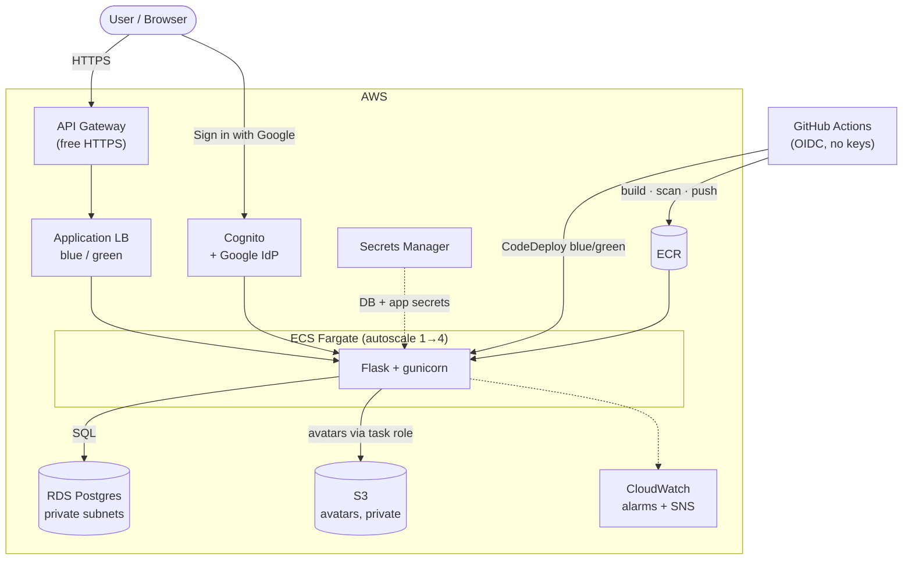

# Flask on AWS ECS Fargate — Production-Style DevOps Platform

[](https://github.com/staplatinumrqm/aws-demo-flask-app1/actions/workflows/deploy.yml)
[](https://github.com/staplatinumrqm/aws-demo-flask-app1/actions/workflows/terraform-ci.yml)


A containerized Flask web app + REST API deployed to AWS with a full DevOps platform
around it: infrastructure as code, automated CI/CD with security gates, blue/green
deployments, observability, autoscaling, federated **Sign in with Google** (Cognito),
and remote Terraform state — all provisioned with Terraform and shipped through GitHub
Actions using OIDC (no long-lived AWS keys).

**🔗 Live demo:** https://cxg56eg1y2.execute-api.us-east-1.amazonaws.com

> Demonstrates: AWS (ECS Fargate, ALB, API Gateway, RDS, Cognito, CodeDeploy, ECR, IAM,
> CloudWatch, S3, Secrets Manager), Terraform modules + remote state, GitHub Actions
> CI/CD, container + IaC security scanning, blue/green deployments, load-tested
> autoscaling, and OIDC-federated authentication.

---

## Architecture



All resources live in a single VPC: public subnets for the ALB and tasks, private
subnets for RDS. CloudWatch alarms feed an SNS topic and drive CodeDeploy auto-rollback.

## Demo

<!-- Record a short GIF of: sign in with Google → profile → upload picture → write a post,
     save it to docs/demo.gif, then uncomment the line below. -->
<!--  -->

1. Open the live demo, click **Sign in with Google**.
2. A profile is created from your Google identity; upload a picture and write a post.
3. Browse other profiles read-only — write actions are gated to the signed-in owner.

---

## Tech stack

| Layer | Technology |
|-------|-----------|
| Application | Python, Flask, SQLAlchemy, gunicorn |
| Database | Amazon RDS PostgreSQL (credentials in Secrets Manager) |
| Object storage | Amazon S3 (private bucket for profile pictures, task-role access) |
| Container | Docker (multi-stage), Amazon ECR (scan-on-push) |
| Compute | Amazon ECS Fargate |
| Networking | VPC, public/private subnets, ALB, security groups |
| Deployment | AWS CodeDeploy (blue/green) |
| CI/CD | GitHub Actions + OIDC |
| IaC | Terraform (S3 + DynamoDB remote state) |
| Security | Trivy (image + IaC), least-privilege IAM, Dependabot |
| Observability | CloudWatch dashboards, alarms, SNS alerts |
| Autoscaling | Application Auto Scaling (target tracking) |

---

## API

| Method | Path | Description |
|--------|------|-------------|
| `GET` | `/` | Status page (profile/post/item counts) |
| `GET` | `/health` | Liveness + DB connectivity (ALB health check) |
| `GET` / `POST` | `/api/profiles` | List / create user profiles |
| `GET` / `DELETE` | `/api/profiles/<id>` | Fetch (with posts) / delete a profile |
| `POST` | `/api/profiles/<id>/avatar` | Upload profile picture (multipart) → S3 |
| `GET` | `/api/profiles/<id>/avatar` | Fetch profile picture (streamed from S3) |
| `GET` / `POST` | `/api/profiles/<id>/posts` | List / create posts for a profile |
| `GET` / `POST` | `/api/items` | Simple item CRUD |
| `GET` | `/api/cpu?ms=<n>` | CPU-bound work (used to exercise autoscaling) |

Profiles and posts are stored in **RDS Postgres**; profile pictures live in a private
**S3** bucket and are accessed via the ECS **task role** (no access keys).

---

## CI/CD pipelines (GitHub Actions)

| Workflow | Trigger | Purpose |
|----------|---------|---------|
| `app-ci.yml` | Pull request | Run pytest |
| `terraform-ci.yml` | PR / push (terraform/**) | `fmt`, `validate`, TFLint, Trivy IaC scan |
| `terraform-plan.yml` | PR (terraform/**) | `terraform plan` posted as a PR comment (read-only OIDC role) |
| `deploy.yml` | Push to main (app changes) | Test → build → Trivy image scan → push to ECR → CodeDeploy blue/green |

**Deploy flow:** authenticate via OIDC → build image → **Trivy scan (block on fixable
CRITICAL)** → push to ECR → render the live task definition with the new image →
CodeDeploy shifts traffic blue→green after health checks, with **automatic rollback**
if the CloudWatch 5xx alarm trips.

---

## Security

- **No static AWS credentials** — GitHub Actions authenticates via OIDC; the deploy
  role's trust is scoped to the `main` branch, and `plan` uses a separate read-only role.
- **Least-privilege IAM** for every role (task execution, task, CodeDeploy, CI).
- **DB credentials in Secrets Manager** — generated and rotated by RDS, injected into the
  task at launch; never in code or Terraform state.
- **Two-layer scanning** — Trivy on container images (CVEs) and on Terraform (misconfig).
- **Network isolation** — tasks accept traffic only from the ALB; RDS only from the tasks.
- **Documented risk acceptances** in [`.trivyignore`](.trivyignore).

---

## Observability & autoscaling

- **Dashboard**: ALB request count / HTTP codes / latency percentiles, ECS CPU & memory,
  healthy host counts.
- **Alarms → SNS email**: ALB 5xx (also drives rollback), target 5xx, p95 latency,
  ECS CPU, ECS memory.
- **Autoscaling**: target-tracking on CPU (60%) and memory (70%), 1–4 tasks. Verified
  under load — see [`loadtest/`](loadtest/).

---

## Repository layout

```
app/                 Flask application (+ entrypoint, templates)
tests/               pytest suite (runs on SQLite — no DB needed in CI)
terraform/           root config (ALB, ECS, CodeDeploy, IAM, observability)
  modules/
    networking/      VPC, subnets, route tables, security groups
    database/        RDS Postgres, subnet group, secret access
loadtest/            k6 script + dependency-free Python load generator
.github/workflows/   CI/CD pipelines
appspec.yaml         CodeDeploy ECS deployment spec
Dockerfile           multi-stage build
```

Reusable modules expose clean inputs/outputs; the root composes them and wires the
remaining resources. The refactor used Terraform `moved` blocks so resources were
relocated in state with **zero** infrastructure changes.

---

## Architecture decisions

| Decision | Why |
|----------|-----|
| **ECS Fargate** (not EKS/EC2) | No cluster/node ops; right-sized for one service; pay-per-task. EKS would be over-engineering here. |
| **Blue/green via CodeDeploy** | Zero-downtime deploys with instant, automatic rollback on a CloudWatch 5xx alarm — safer than rolling updates. |
| **API Gateway for HTTPS** (not CloudFront) | CloudFront is gated on this unverified AWS account; API Gateway gives a free, valid HTTPS endpoint and works as the Cognito callback. Documented as a trade-off, not an oversight. |
| **Cognito + Google federation** | Managed auth (no password storage); free tier covers 50k users; the hosted UI removes the need to build/secure a login form. |
| **GitHub OIDC** (no static keys) | Short-lived credentials per run; deploy role scoped to `main`, plan role read-only — least privilege. |
| **Secrets in Secrets Manager** | DB + app secrets injected into the task at launch; never in code, image, or Terraform state. |
| **Public subnets + task role for S3** | Avoids a paid NAT gateway; RDS stays private; S3 access uses the task role (no keys). |
| **Trivy gate on CRITICAL only** | Blocks merges/deploys on critical findings while accepted risks (HTTP-only, egress) are documented in [`.trivyignore`](.trivyignore). |

## Operations

See the [runbook](docs/RUNBOOK.md) for rollback, scaling, secret rotation, and incident steps.

---

## Getting started

### Prerequisites
- AWS account + credentials configured locally
- Terraform >= 1.5, Docker, a GitHub repo

### Provision infrastructure
```bash
cd terraform
cp terraform.tfvars.example terraform.tfvars   # fill in your values
terraform init
terraform apply
```

### Wire up GitHub Actions
Add these repo secrets (values from `terraform output`):
- `AWS_ROLE_ARN` → `github_actions_role_arn`
- `AWS_PLAN_ROLE_ARN` → `terraform_plan_role_arn`

Push to `main` to trigger the first deploy.

### Load test
See [`loadtest/README.md`](loadtest/README.md).

---

## Roadmap

- [x] CI/CD with OIDC, blue/green deploys, auto-rollback
- [x] Remote Terraform state (S3 + DynamoDB)
- [x] Security scanning (Trivy image + IaC), Dependabot
- [x] Observability (dashboard, alarms, SNS)
- [x] Autoscaling (load-tested)
- [x] RDS Postgres + functional CRUD API (Secrets Manager)
- [x] Refactor Terraform into reusable modules (`networking`, `database`)
- [x] Server-rendered web frontend (feed, profiles, posts, photo upload)
- [x] Free HTTPS via API Gateway
- [x] Sign in with Google via Cognito (federated, session-based)
- [ ] Multi-environment (dev/staging/prod) with Terraform workspaces
- [ ] Distributed tracing (X-Ray / OpenTelemetry)
